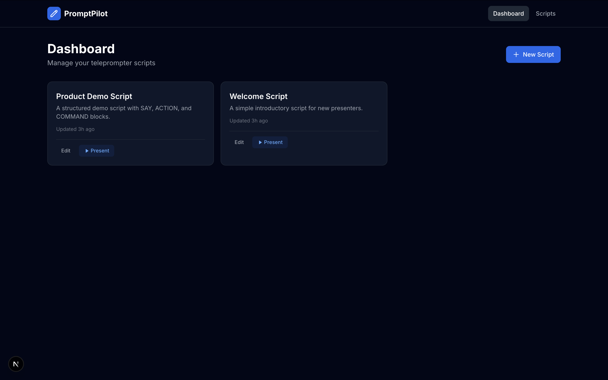
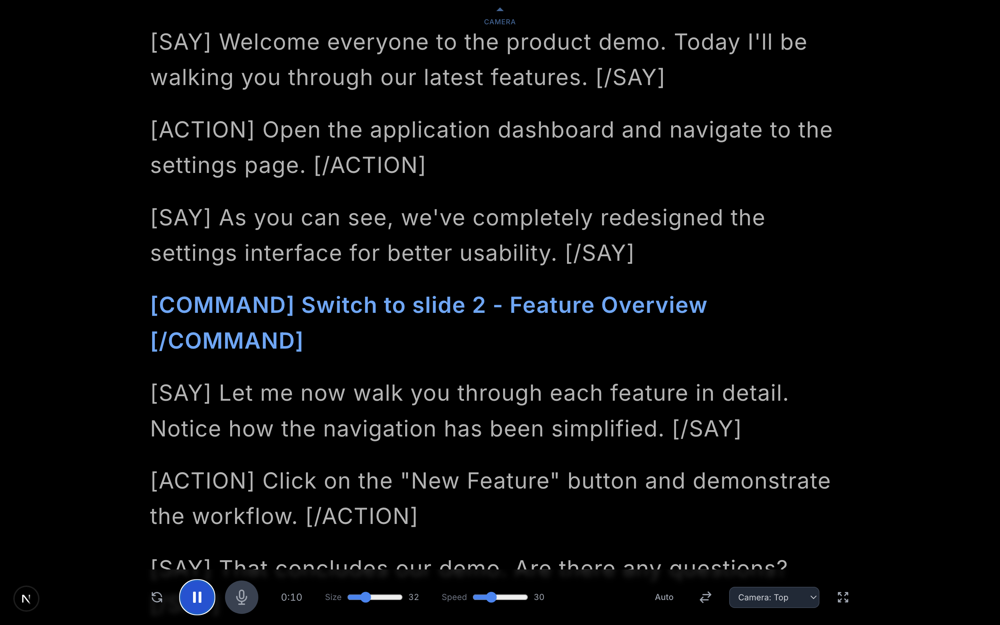
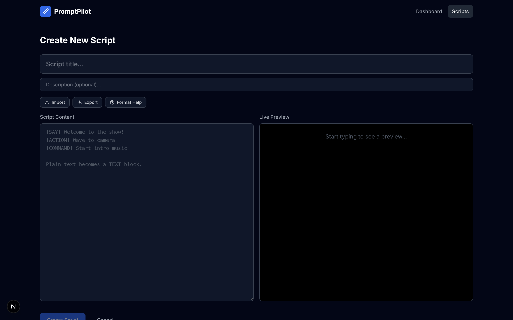

# PromptPilot

**AI-powered teleprompter and demo copilot for speakers, educators, and content creators.**

PromptPilot helps you deliver presentations, tutorials, and live coding sessions smoothly. Write a script, step up to the mic, and let PromptPilot handle the rest -- from auto-scrolling text to executing terminal commands on cue.

## Screenshots

<p align="center">
  
  <br />
  <em>Dashboard — Manage your scripts and jump into presentations</em>
</p>

<p align="center">
  
  <br />
  <em>Teleprompter — Full-screen view with speech-synced scrolling</em>
</p>

<p align="center">
  
  <br />
  <em>Script Editor — Write scripts with live preview of SAY/ACTION/COMMAND blocks</em>
</p>

## Features

- **Teleprompter** — Full-screen scrolling display with adjustable speed and font size
- **Speech Sync** — Hands-free scrolling driven by real-time speech recognition
- **Script Editor** — Write and edit scripts with live preview for the `.copilot` format
- **Demo Copilot** — Structured scripts with SAY, ACTION, and COMMAND blocks for guided demos
- **AI Script Assistant** — Generate, rewrite, and polish scripts with AI *(coming soon)*
- **Keyboard Shortcuts** — Space (play/pause), M (mic toggle), V (voice/auto mode), F (fullscreen)
- **Script Management** — Create, import/export, and organize your presentation scripts

## Quick Start

```bash
# Clone the repository
git clone https://github.com/umarfarookm/promptpilot.git
cd promptpilot

# Install dependencies
pnpm install

# Start the database
docker-compose up -d

# Run migrations and seed data
pnpm db:migrate
pnpm db:seed

# Start the development server
pnpm dev
```

Open [http://localhost:3000](http://localhost:3000) to see the app.

See the full [Getting Started](./docs/getting-started.md) guide for prerequisites and troubleshooting.

## Technology Stack

| Layer | Technology |
|-------|------------|
| Frontend | Next.js 15 (App Router), React 19, Tailwind CSS |
| Backend | Express, Node.js |
| Database | PostgreSQL (raw SQL via node-postgres) |
| Speech | Web Speech API (browser-native) |
| Monorepo | pnpm workspaces, Turborepo |
| Language | TypeScript (end to end) |

## Project Structure

```
promptpilot/
  apps/
    web/              Next.js frontend
    api/              Express backend API
  packages/
    types/            Shared TypeScript types
    ui/               Reusable React components
  services/
    script-engine/    .copilot parser and runtime
  docs/               Documentation
  examples/           Example scripts
```

See the [Architecture](./docs/architecture.md) overview for details on data flow and build pipeline.

## Documentation

- [Getting Started](./docs/getting-started.md) — Setup and installation
- [Script Format](./docs/script-format.md) — Full `.copilot` format specification
- [Architecture](./docs/architecture.md) — System design and component overview
- [Roadmap](./ROADMAP.md) — Planned features and milestones

## Contributing

Contributions are welcome. Please read the [Contributing Guide](./CONTRIBUTING.md) for details on our branch workflow, code style, and pull request process.

## License

This project is licensed under the [MIT License](./LICENSE).
